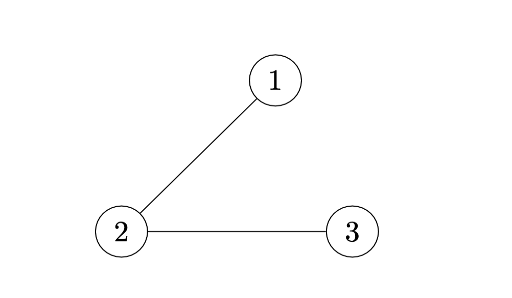

# Cheap numbering of vertices in a graph

## Problem

The input to the problem is a graph `G` with vertex set `V` and edge set `E`. (`G` has at least one vertex.)  
The problem is to number the vertices with the numbers 1,2,3,..., |V|.  
This numbering is described by a bijective function `f: V -> {1,2,3,...,|V|}`, which is the output of the algorithm.  
The numbering should be such that the sum of `| f(u) - f(v) |` over all edges `(u,v) ∈ E` is as small as possible.  
This problem can be solved efficiently for some types of graphs, but seems difficult for a general graph. You should therefore construct an algorithm using exhaustive search.  
Describe your algorithm with pseudo code and calculate its time complexity (make a tight analysis that you specify with big O).  

It is up to you to decide exactly how the input and output should be represented but remember that it should be a function.

## Solution

A bijective function is a mapping from one set to another where each element of the first set maps to exactly one element of the second set, and vice versa. Since the algorithm requires assigning unique numbers to the vertices, a map holding key-value pairs is an appropriate data structure to represent this bijective function, ensuring that each vertex is assigned a unique number.

The solution includes an exhaustive search where every possible vertex numbering permutation is examined. For each permutation, the algorithm computes the sum of absolute differences between the assigned numbers for all pairs of vertices connected by an edge. The permutation with the smallest sum is considered the optimal vertex numbering.

Consider a simple graph with numbered vertices like the following: 1, 2, and 3 forming the edges 1-2 and 2-3. The graph can be represented as follows:

Since there are 3 vertices, the algorithm needs to examine all 3! = 6 permutations of the numbers [1, 2, 3]. It is a prerequisite that all nodes in the graph are identified by numbers. These numbers index the permutations, eliminating the need for actual numbering of the nodes, since the desired output is a function. For each number in a permutation, a node identifier is mapped to it. When the best permutation is found, this map becomes our output.

For example:

1. [1,2,3] denotes the mapping 1 -> 1, 2 -> 2, 3 -> 3:
    - Absolute difference sum: |1-2| + |2-3| = 2.

2. [2,1,3] denotes the mapping 1 -> 2, 2 -> 1, 3 -> 3:
    - Absolute difference sum: |2-1| + |1-3| = 3.

3. [3,2,1] denotes the mapping 1 -> 3, 2 -> 2, 3 -> 1:
    - Absolute difference sum: |3-2| + |2-1| = 2.

From these permutations above, we observe that the mappings yielding the minimal sum of 2 are the optimal solutions. For instance, an optimal permutation would be [3,2,1] which denotes the mapping 1 -> 3, 2 -> 2, 3 -> 1 and this mapping could serve as the desired bijective function.

However, we cannot draw this conclusion until all 3! possible permutations for these vertices are examined.

## Time Complexity Analysis

Let V be the number of vertices and E be the number of edges in the given graph. The non-constant operations in the algorithm that contribute to its time complexity are broken down as follows:

1. **Generating permutations**: Using Heap's algorithm, generating all possible permutations of the V vertices takes:
    - T1(n) = `O(V x V!)`
2. **Iteration over permutations and evaluating edges**: For each permutation, we evaluate all edges of the graph. This operation takes:
    - T2(n) = `O(V!) x O(V + E) = O((V + E) x V!)`
3. **Assignment to Map**: Assigning values to the map `f` for V vertices.
    - T3(n) = `O(V)`

Combining the individual complexities, the total time complexity is:
- T(n) = `O(V! x (V + E))`

## Complexity Insights

**Edge Iteration with an Adjacency List**: Before delving into the primary complexity bounds, it is crucial to note the characteristics of the adjacency list. Iterating through edges with an adjacency list has a typical time complexity of `O(V + E)`. In the worst-case scenario, such as in a complete graph where `E` can approach `V(V-1)/2`, the time complexity would be `O(V^2)`. Yet, given the dominant `V!` term in our algorithm, these variations in the edge iteration are overshadowed. For the sake of our analysis, edge iteration complexities, whether favorable or otherwise, are regarded as having consistent bounds.

**Lower and Upper Bounds**: The algorithm’s nature is exhaustive. Whether the optimal solution is found in the first permutation or the last, all permutations need evaluation. This consistency in behavior determines that the best-case complexity matches the worst-case scenario.
